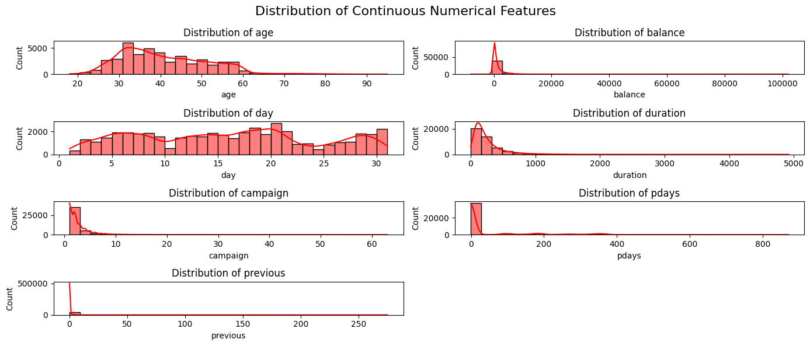
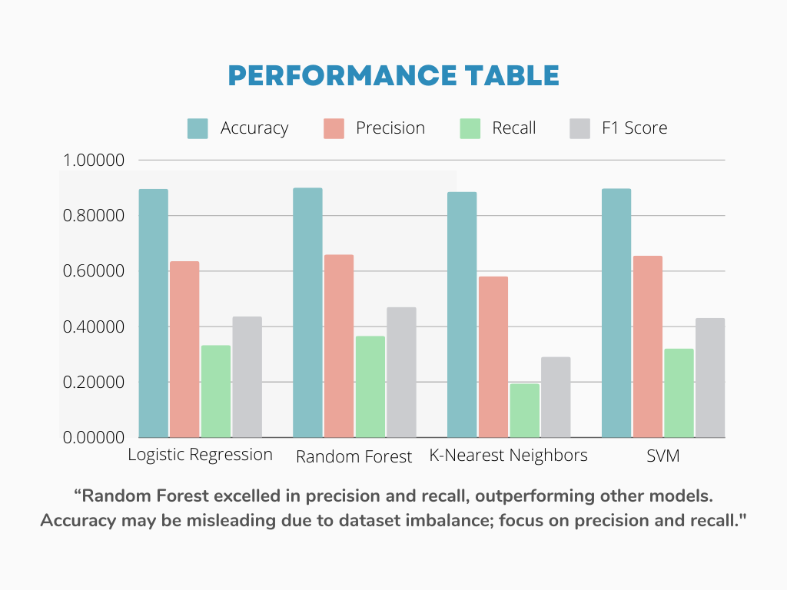

# Bank Marketing Prediction

## Overview

This project delves into the analysis of direct marketing campaigns conducted by a Portuguese banking institution. The main objective is to **predict whether clients will subscribe to a term deposit based on various features collected during the campaigns**. Through thorough analysis and machine learning techniques, we aim to provide insights into the factors influencing client decisions and optimize future marketing strategies.

## Dataset
The dataset consists of :
age, job, marital, education, default, balance, housing, loan, contact, day, month, duration, campaign, pdays, previous, poutcome, Target(y)

This dataset encompasses various features related to client demographics, previous campaign interactions, economic indicators, and social factors.

## Classification Goal
The primary classification goal is to predict whether a client will subscribe (`yes` or `no`) to a term deposit (variable `y`). This binary classification task involves employing machine learning algorithms to train predictive models based on historical campaign data.


## Data Analysis
**Exploratory Data Analysis (EDA)**: Conducted comprehensive EDA to understand the distribution of features, identify outliers, and explore relationships between variables.




**Feature Engineering**: Engineered new features and transformed existing ones to enhance predictive power and model performance.Applied **oversampling with SMOTE** to address the dataset's class imbalance. 


## Conclusion
 **Predictive Performance**: Explored four different machine learning models including **K-Nearest Neighbors (KNN)**, **Support Vector Machine (SVM)**, **Random Forest**, and **Logistic Regression**. Utilizing hyperparameter tuning via GridsearchCV, And optimized the parameters for each model.
 

- **Evaluation of Model Performance**: Random Forest exhibited superior performance with notably **higher precision** and **recall** compared to other models, showcasing its effectiveness in identifying **positive instances**. Accuracy may not be a reliable metric due to the dataset's imbalance, emphasizing the importance of prioritizing precision and recall for this task.

- **Strategic Insights**: Generated strategic insights to optimize future marketing efforts. These insights include identifying target demographics with a high propensity to subscribe to term deposits, refining communication strategies, and allocating resources effectively.

## Technologies Used
- **Python Libraries**: Leveraged Pandas for data manipulation, Scikit-learn for machine learning modeling, and Matplotlib along with Seaborn for data visualization.
- **Google Colab**: Utilized Google Colab for collaborative development and execution of `Jupyter notebooks`.

 
## Getting Started
To get started with this project:

1. **Clone Repository**: Clone this repository to your local machine.
   ```
   git clone https://github.com/your-username/direct-marketing-analysis.git
   ```
2. **Download Dataset**: Download the dataset file `bank_full.csv`.
3. **Install Dependencies**: Install the required dependencies by running the following command:
   ```
   pip install -r requirements.txt
   ```
4. **Explore Notebooks**: Explore the colab notebook provided in the repository to understand the data analysis and machine learning model implementation.

## License
This project is licensed under the [MIT License](LICENSE), allowing for modification and distribution under certain conditions.

---
